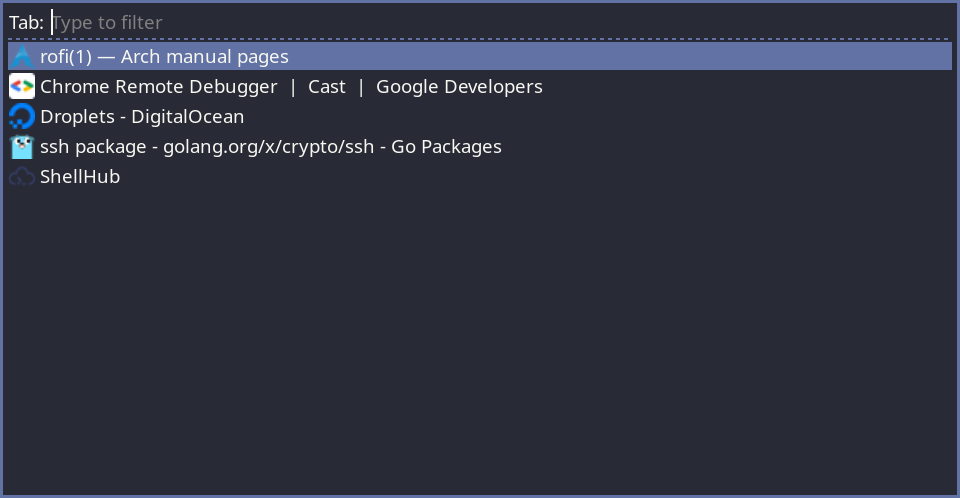

# Introduction

To use this script you need to enable chrome remote debugging by starting it with the
`remote-debugging-port` command-line switch (e.g. `google-chrome --remote-debugging-port=9222`).

# Dependencies

* cURL
* jq

